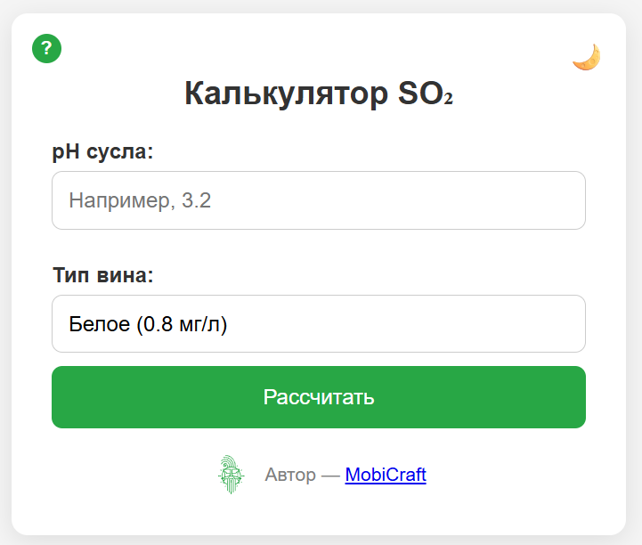
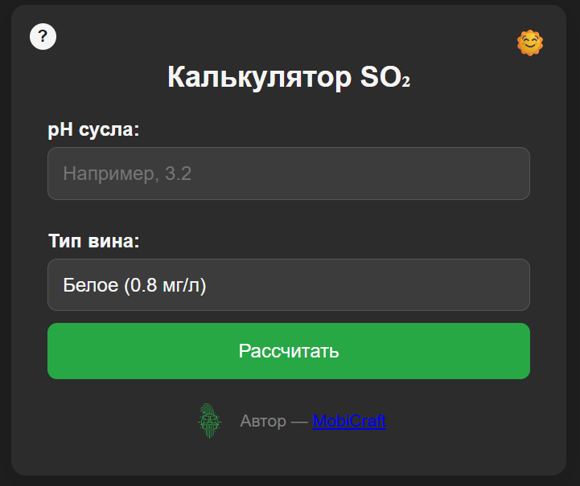

# 🍷 SO₂ Calculator

Веб-приложение для виноделов, которое помогает рассчитать необходимое количество 
**метабисульфита калия (K₂S₂O₅)** на 100 литров виноградного сусла 
в зависимости от pH и желаемого уровня молекулярного SO₂.

---

## ✨ Возможности

✅ Расчёт дозировки K₂S₂O₅ в граммах на 100 л сусла  
✅ Учет типа вина: **белое (0.8 мг/л)** или **красное (0.5 мг/л)**  
✅ Возможность задать собственное значение молекулярного SO₂  
✅ Чистый и современный интерфейс  
✅ Переключение между 🌞 светлой и 🌙 тёмной темами  

---

## 🚀 Использование

1. Введите текущее значение **pH сусла**  
2. Выберите тип вина или введите своё значение SO₂  
3. Нажмите кнопку **"Рассчитать"**  
4. Получите результат в граммах K₂S₂O₅ на 100 л сусла  

---

## ⚙️ Установка и запуск

Склонируйте репозиторий и откройте файл `index.html` в браузере:

```bash
git clone https://github.com/username/so2-calculator.git
cd so2-calculator
```

Никаких зависимостей не требуется 🚀

---

## 📷 Скриншоты

### Светлая тема


### Тёмная тема



---

## 📚 Формулы

Расчёт основан на уравнении для молекулярного SO₂:

```
free SO₂ = molecular SO₂ × (1 + 10^(pH - pKa))
```

где pKa = **1.81** для сернистой кислоты.  
Пересчёт в граммы K₂S₂O₅ на 100 л:

```
граммы = free SO₂ × 0.17544
```

---

## 🛠 Стек

- **HTML5**
- **CSS3**
- **JavaScript (Vanilla)**
- Без сторонних библиотек 💡

---

## 📜 Лицензия

Этот проект распространяется под лицензией **MIT**.  
Вы можете свободно использовать и модифицировать его.

---

👨‍💻 Автор: **MobiCraft**
